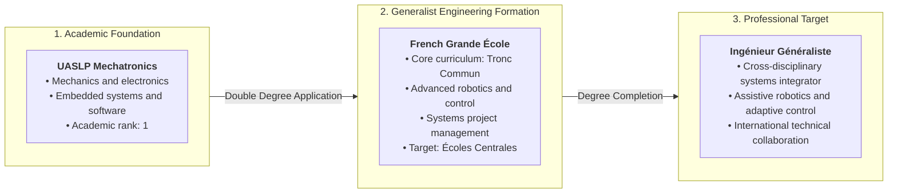
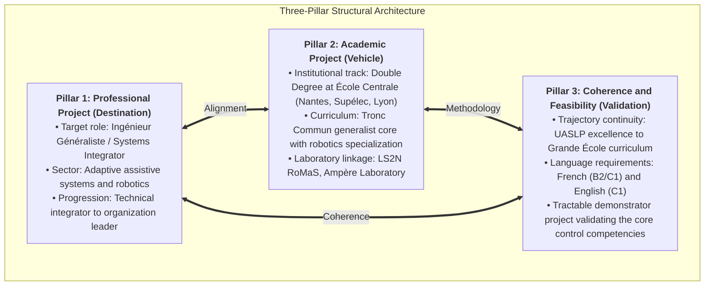
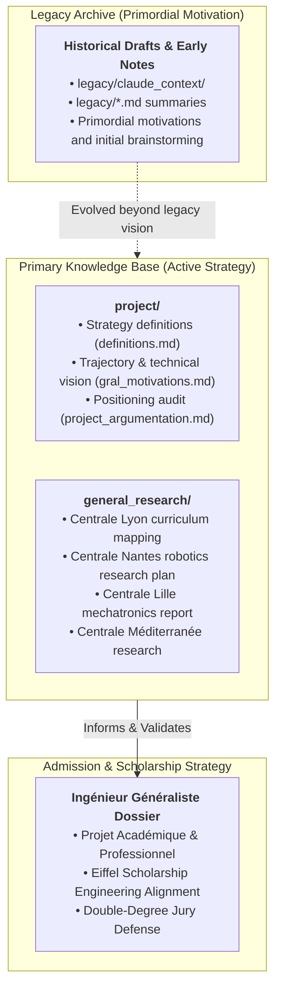

# Notre Constellation
## Academic and Professional Strategy Portfolio: Ingénieur Généraliste Pathway

---

## 1. Overview and Core Scope

Notre Constellation is the central documentation repository for the Academic and Professional Project (*Projet Académique & Professionnel*) of Cristopher Hernández (UASLP Mechatronics Engineering, Rank 1). The objective is the admission to the Double-Degree program within the French *Grandes Écoles* network (Groupe des Écoles Centrales) supported by the *France Excellence Eiffel* scholarship.

The repository establishes the candidate's positioning under the **Ingénieur Généraliste** (Generalist Engineer) framework, structured as an *Ingénieur Intégrateur* who bridges mechanical design, embedded electronics, and adaptive control theory for complex systems.



---

## 2. The Ingénieur Généraliste Identity and Role Scope

In the French Grande École curriculum, the **Ingénieur Généraliste** operates at the intersection of technical disciplines and system-level management. Rather than specializing narrowly in mechanism design or biomedical algorithms, the candidate focuses on the integration layer: coordinating actuation, sensing, embedded control loops, and operational feasibility.

---

## 3. Project Structural Framework

The strategy follows a three-pillar structure designed to satisfy the criteria of Campus France, Grande École admission juries, and the Eiffel scholarship engineering panel:


---

## 4. Knowledge Architecture and Evolution

The repository distinguishes between active strategic assets and historical foundation material:



---

## 5. Repository Index and Navigation

The repository is organized into primary operational directories and a historical archive:

```
notre_constellation/
├── README.md                          General overview, framework, and navigation index
├── AGENTS.md                          Repository constraints (Ingénieur Généraliste role and formatting)
│
├── project/                           [PRIMARY] Core strategy and narrative definitions
│   ├── definitions.md                 The 3-Pillar project framework and verification criteria
│   ├── gral_motivations.md            Personal background, trajectory, and technical rationale
│   └── project_argumentation.md       Argumentation analysis, consistency audit, and positioning
│
├── general_research/                  [PRIMARY] Institutional & curriculum research files
│   ├── Centrale Lille Mechatronics Engineering Report.md
│   ├── Centrale Nantes Mechatronics Research Plan.md
│   ├── Programme Mécatronique Centrale Lyon.md
│   └── Recherche Centrale Méditerranée Mécatronique.md
│
├── utils/                             Utility conversion scripts
│   └── pdf_2_md.py                    PDF to Markdown conversion helper
│
└── legacy/                            [HISTORICAL] Primordial motivation and legacy notes
    ├── claude_context/                Superseded working notes and preliminary drafts
    │   ├── general_project_scope.md
    │   ├── latest_pitch_version.md
    │   ├── motivation_checkpoint.md
    │   ├── school_independient_analysis.md
    │   └── terms_general_definitions.md
    ├── legacy_ecoles_research_summary.md
    ├── legacy_professional_project_summary.md
    ├── legacy_roadmaps_and_paths.md
    └── legacy_skills_and_knowledge_trees.md
```

### Detailed Document Directory

#### Primary Active Sources

| Directory | File | Primary Purpose |
|---|---|---|
| `project/` | [`definitions.md`](file:///c:/Users/Gokus/OneDrive/Escritorio/notre_constellation/project/definitions.md) | Defines the 3 core pillars (Professional Project, Academic Project, Coherence & Feasibility) and validation checklists. |
| `project/` | [`gral_motivations.md`](file:///c:/Users/Gokus/OneDrive/Escritorio/notre_constellation/project/gral_motivations.md) | Complete personal trajectory, interest in assistive systems, market problems, and 15-year career progression. |
| `project/` | [`project_argumentation.md`](file:///c:/Users/Gokus/OneDrive/Escritorio/notre_constellation/project/project_argumentation.md) | Structural evaluation of narrative coherence, founder vs. systems-integrator balance, and audience targeting. |
| `general_research/` | [`Centrale Lille Mechatronics Engineering Report.md`](file:///c:/Users/Gokus/OneDrive/Escritorio/notre_constellation/general_research/Centrale%20Lille%20Mechatronics%20Engineering%20Report.md) | Deep-dive institutional and curriculum analysis for Centrale Lille. |
| `general_research/` | [`Centrale Nantes Mechatronics Research Plan.md`](file:///c:/Users/Gokus/OneDrive/Escritorio/notre_constellation/general_research/Centrale%20Nantes%20Mechatronics%20Research%20Plan.md) | Academic programs, robotics laboratories (LS2N), and research pathways at Centrale Nantes. |
| `general_research/` | [`Programme Mécatronique Centrale Lyon.md`](file:///c:/Users/Gokus/OneDrive/Escritorio/notre_constellation/general_research/Programme%20M%C3%A9catronique%20Centrale%20Lyon.md) | Generalist curriculum, mechatronics track, and Ampère lab alignment at Centrale Lyon. |
| `general_research/` | [`Recherche Centrale Méditerranée Mécatronique.md`](file:///c:/Users/Gokus/OneDrive/Escritorio/notre_constellation/general_research/Recherche%20Centrale%20M%C3%A9diterran%C3%A9e%20M%C3%A9catronique.md) | Institutional profile, engineering tracks, and research integration at Centrale Méditerranée. |

#### Legacy and Historical Archive (Primordial Motivation Only)

> [!NOTE]
> Documents under `legacy/` (including `legacy/claude_context/`) represent primordial motivations, early brainstorming, and superseded drafting perspectives. They serve strictly as historical origins and are not active knowledge sources for the current *Ingénieur Généraliste* strategy.

| Directory | File | Historical Context |
|---|---|---|
| `legacy/claude_context/` | [`general_project_scope.md`](file:///c:/Users/Gokus/OneDrive/Escritorio/notre_constellation/legacy/claude_context/general_project_scope.md) | Early document mapping and preliminary scope demarcation. |
| `legacy/claude_context/` | [`latest_pitch_version.md`](file:///c:/Users/Gokus/OneDrive/Escritorio/notre_constellation/legacy/claude_context/latest_pitch_version.md) | Previous pitch scripts and preliminary interview structures. |
| `legacy/claude_context/` | [`motivation_checkpoint.md`](file:///c:/Users/Gokus/OneDrive/Escritorio/notre_constellation/legacy/claude_context/motivation_checkpoint.md) | Early alignment checks against initial criteria. |
| `legacy/claude_context/` | [`school_independient_analysis.md`](file:///c:/Users/Gokus/OneDrive/Escritorio/notre_constellation/legacy/claude_context/school_independient_analysis.md) | Preliminary school evaluations (superseded by `general_research/`). |
| `legacy/claude_context/` | [`terms_general_definitions.md`](file:///c:/Users/Gokus/OneDrive/Escritorio/notre_constellation/legacy/claude_context/terms_general_definitions.md) | Early glossary definitions. |
| `legacy/` | [`legacy_ecoles_research_summary.md`](file:///c:/Users/Gokus/OneDrive/Escritorio/notre_constellation/legacy/legacy_ecoles_research_summary.md) | Initial exploratory notes on French Grandes Écoles. |
| `legacy/` | [`legacy_professional_project_summary.md`](file:///c:/Users/Gokus/OneDrive/Escritorio/notre_constellation/legacy/legacy_professional_project_summary.md) | Synthesis of initial project drafts. |
| `legacy/` | [`legacy_roadmaps_and_paths.md`](file:///c:/Users/Gokus/OneDrive/Escritorio/notre_constellation/legacy/legacy_roadmaps_and_paths.md) | Preliminary alternative career paths. |
| `legacy/` | [`legacy_skills_and_knowledge_trees.md`](file:///c:/Users/Gokus/OneDrive/Escritorio/notre_constellation/legacy/legacy_skills_and_knowledge_trees.md) | Initial mechatronics skill trees. |

---