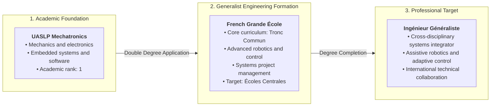
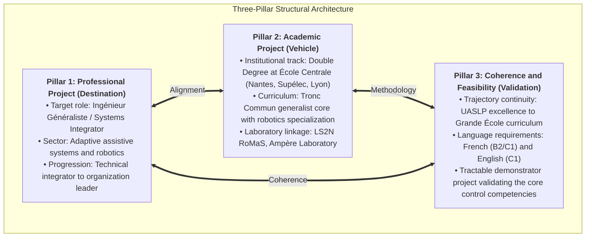

# Notre Constellation
## Academic and Professional Strategy Portfolio: Ingénieur Généraliste Pathway

---

## 1. Overview and Core Scope

Notre Constellation is the central documentation repository for the Academic and Professional Project (*Projet Académique & Professionnel*) of Cristopher Hernández (UASLP Mechatronics Engineering, Rank 1). The objective is the admission to the Double-Degree program within the French *Grandes Écoles* network (Groupe des Écoles Centrales) supported by the *France Excellence Eiffel* scholarship.

The repository establishes the candidate's positioning under the **Ingénieur Généraliste** (Generalist Engineer) framework, structured as an *Ingénieur Intégrateur* who bridges mechanical design, embedded electronics, and adaptive control theory for complex systems.



---

## 2. The Ingénieur Généraliste Identity and Role Scope

In the French Grande École curriculum, the **Ingénieur Généraliste** operates at the intersection of technical disciplines and system-level management. Rather than specializing narrowly in mechanism design or biomedical algorithms, the candidate focuses on the integration layer: coordinating actuation, sensing, embedded control loops, and operational feasibility.

---

## 3. Project Structural Framework

The strategy follows a three-pillar structure designed to satisfy the criteria of Campus France, Grande École admission juries, and the Eiffel scholarship engineering panel:


---

## 6. Repository Index and Navigation

The repository is organized into distinct directories serving research, project definition, and application drafting:

```
notre_constellation/
├── README.md                      General overview, framework, and navigation index
├── AGENTS.md                      Repository constraints (Ingénieur Généraliste role and formatting)
│
├── project/                       Core strategy and narrative definitions
│   ├── definitions.md             The 3-Pillar project framework and verification criteria
│   ├── gral_motivations.md        Personal background, trajectory, and technical rationale
│   └── project_argumentation.md   Argumentation analysis, consistency audit, and positioning
│
├── general_research/              Institutional and scholarship research files
│   └── (Pending updated benchmarking data)
│
├── claude_context/                Working notes, scope boundaries, and interview drafts
│   ├── general_project_scope.md   Dossier separation, scope boundaries, and positioning rules
│   ├── latest_pitch_version.md    Working drafts for oral presentations and interviews
│   ├── school_independient_analysis.md Detailed evaluation per school program
│   ├── terms_general_definitions.md Operational terms, glossary, and core concepts
│   └── motivation_checkpoint.md   Alignment checks between project narrative and criteria
│
└── legacy/                        Historical research notes and earlier drafts
```

### Detailed Document Directory

| Directory | File | Primary Purpose |
|---|---|---|
| `project/` | [`definitions.md`](file:///c:/Users/Gokus/OneDrive/Escritorio/notre_constellation/project/definitions.md) | Defines the 3 core pillars (Professional Project, Academic Project, Coherence & Feasibility) and validation checklists. |
| `project/` | [`gral_motivations.md`](file:///c:/Users/Gokus/OneDrive/Escritorio/notre_constellation/project/gral_motivations.md) | Complete personal trajectory, interest in assistive systems, market problems, and 15-year career progression. |
| `project/` | [`project_argumentation.md`](file:///c:/Users/Gokus/OneDrive/Escritorio/notre_constellation/project/project_argumentation.md) | Structural evaluation of narrative coherence, founder vs. systems-integrator balance, and audience targeting. |
| `general_research/` | (Pending) | Awaiting fresh data on the target Grandes Écoles. |
| `claude_context/` | [`general_project_scope.md`](file:///c:/Users/Gokus/OneDrive/Escritorio/notre_constellation/claude_context/general_project_scope.md) | Document mapping (Lettre vs. Projet Professionnel vs. Projet Académique) and scope boundary enforcement. |
| `claude_context/` | [`latest_pitch_version.md`](file:///c:/Users/Gokus/OneDrive/Escritorio/notre_constellation/claude_context/latest_pitch_version.md) | Structured spoken-word pitch scripts for admission and scholarship panel interviews. |
| `claude_context/` | [`school_independient_analysis.md`](file:///c:/Users/Gokus/OneDrive/Escritorio/notre_constellation/claude_context/school_independient_analysis.md) | Independent analytical profiles of each target school without cross-comparison bias. |
| `claude_context/` | [`terms_general_definitions.md`](file:///c:/Users/Gokus/OneDrive/Escritorio/notre_constellation/claude_context/terms_general_definitions.md) | Definitions of key terms (Ingénieur Généraliste, Tronc Commun, Systems Integrator, etc.). |

---