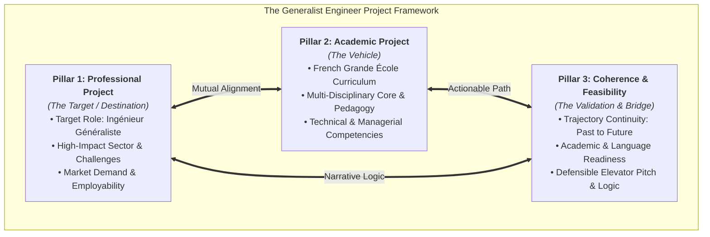

# Core Definitions & Project Construction Framework

This document outlines the foundational definitions and structural framework required to build a solid, convincing **Academic & Professional Project** (*Projet Académique & Professionnel*) tailored for the **Generalist Engineer** (*Ingénieur Généraliste*) pathway (Grandes Écoles / Campus France).

---

## The 3 Core Pillars to Build the Project

To build an impactful, coherent project that stands up to academic and consular review (e.g., Campus France, Grande École admissions committees), the project must be structured around **three fundamental pillars**:

---

### Pillar 1: The Professional Project (*Projet Professionnel*) — The Destination
The **Professional Project** is the career roadmap defining where you want to go, why, and in what capacity. For a **Generalist Engineer**, this means positioning yourself not as a narrow specialist, but as a multidisciplinary problem solver and technical leader capable of orchestrating complex systems.

* **Self-Awareness & Baseline:**
  * Personal background, core scientific/technical strengths, areas for growth, and intrinsic motivations.
* **Target Role & Sector:**
  * Precise target position (e.g., *Systems Engineer, Cross-Functional Technical Project Manager, Industrial Operations Engineer, Innovation Consultant*).
  * Target industries (e.g., energy transition, aerospace, smart mobility, complex automation, digital transformation).
* **Market Need & Employability:**
  * Concrete market demand for engineers with transversal, cross-disciplinary competency and systems-level vision (both internationally and locally).
* **Strategic Roadmap:**
  * Short-term, medium-term, and long-term career progression milestones following graduation.

---

### Pillar 2: The Academic Project (*Projet Académique*) — The Vehicle
The **Academic Project** is the educational strategy that bridges your current qualifications and your ultimate professional target. It justifies why a **French Generalist Engineering Program** (*Formation d'Ingénieur Généraliste*) is essential.

* **Rationale for the "Ingénieur Généraliste" Curriculum:**
  * Why a generalist Grande École model? (Broad multi-domain scientific foundation: mechanics, electronics, software/data, materials, coupled with project management, economics, and leadership).
  * How this polyvalent training enables you to bridge the gap between technical specialists and executive decision-makers.
* **Institutional & Pedagogical Alignment:**
  * Why France and specific targeted institutions (e.g., Écoles Centrales, Mines-Télécom, INSA, Polytech)?
  * Specific pedagogical methods: project-based learning (*pédagogie par projet*), mandatory industry internships, research laboratories, and dual-competency options.
* **Targeted Learning Outcomes:**
  * Specific scientific, technical, linguistic (French/English fluency), and managerial competencies to acquire.

---

### Pillar 3: Coherence & Feasibility (*Cohérence & Faisabilité*) — The Bridge & Validation
A project is only as strong as its narrative logic and practical viability. This pillar ensures that the connection between your past, your studies, and your future career is seamless, realistic, and defensible.

* **Trajectory Continuity (Past $\rightarrow$ Present $\rightarrow$ Future):**
  * Clear demonstration that the Generalist Engineering degree is the natural and necessary next step crowning your prior studies.
* **Academic & Linguistic Readiness:**
  * Mastery of prerequisites (mathematics, physics, computer science fundamentals).
  * Validated language proficiency (French B2/C1, English B2/C1) for academic and professional success.
* **Operational Feasibility:**
  * Realistic timeline, financial planning, administrative readiness, and availability of required academic resources.

---

## Verification & Stress-Testing Framework

Before finalizing the project documentation or preparing for interviews, evaluate the project against these validation benchmarks:

### 1. Key Verification Checklist
* **Clarity of Purpose:** Can the entire project and target role be summarized clearly in a single compelling sentence (the "Elevator Pitch")?
* **Logical Flow:** Does every course module and academic choice directly serve the goal of becoming an *Ingénieur Généraliste* in the targeted domain?
* **Realistic Scope:** Is the academic and professional progression aligned with current market expectations and entry requirements?

### 2. Validation Methods
* **The Oral Defense Test:** Present the project simply and fluently to a non-technical peer or mentor. Every follow-up question should have a natural, logical response.
* **External Critical Review:** Have professors, professional engineers, or alumni critique the project to identify ambiguities or weak links.

---

## Strategic Guiding Questions

Use these questions as a checklist when formulating the personal and academic statements:

1. **Academic Field & Foundation:** What is your core academic background and how does it prepare you for a multidisciplinary engineering curriculum?
2. **Target Role & Vision:** What specific *Ingénieur Généraliste* position, challenges, or industry do you aim to tackle?
3. **The French Educational Value-Add:** What specific skills and experiences will the French engineering ecosystem deliver that cannot be obtained elsewhere?
4. **Language & Adaptation Readiness:** What is your current French language certification level and readiness to study in an intensive French engineering environment?
